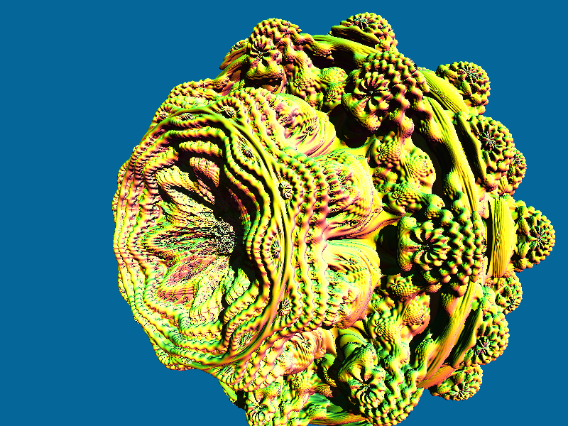
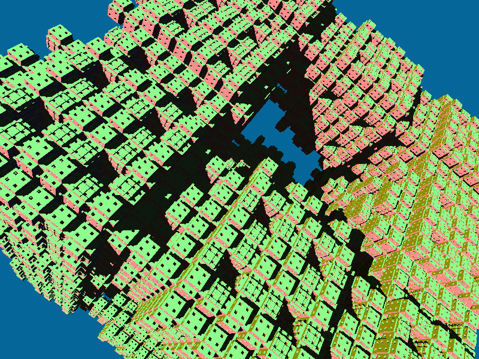
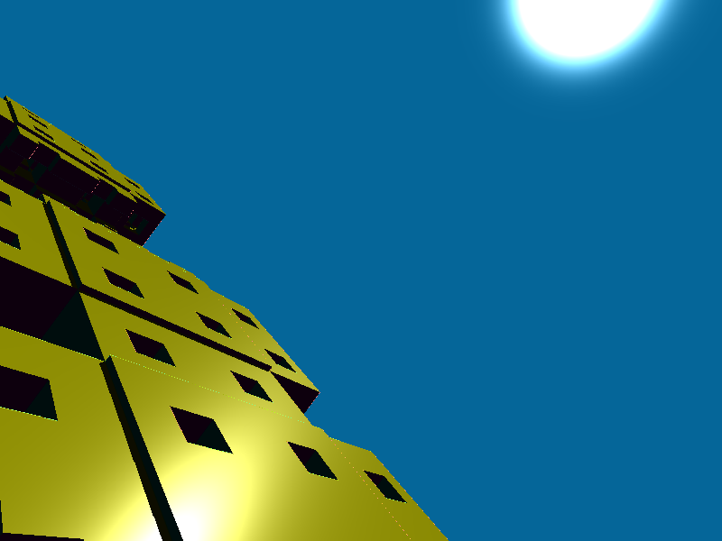

# raymarcher
Simple ray marcher written in Rust using wgpu.

## Winit Controls
WASD to move

Left click to look around

Space to switch scenes

## Android Controls
Gyro to look around in all cases except when 1 pointer is down.

If 1 pointer is down, then that pointer is used to look around.

2 Pointers to move forwards

3 Pointers to move backwards

Double tap to switch scene.

## Screenshots

